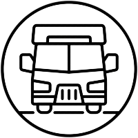

[EN](https://github.com/KorolikD/rental-camper/blob/main/README.md)

# CamperRentalUA 

Представляємо CamperRentalUA - Наш проект - це зручний та простий у використанні
веб-сервіс оренди камперів в Україні, який дозволяє подорожувати та відкривати
нові місця без обмежень, не маючи власного автомобіля.

**Тож, вирушайте в дорогу з нашим додатком і знайдіть свій ідеальний кемпер для
незабутньої подорожі**

## 🔧 Основний функціонал:

1. **Широкий вибір камперів різних типів та розмірів:** Застосунок пропонує
   широкий вибір камперів різних типів, що відповідають різним потребам та
   вимогам користувачів.
2. **Онлайн бронювання камперів:** Користувач може легко та швидко забронювати
   кемпер за допомогою застосунка, вказавши дати та інші необхідні параметри.
3. **Простий інтерфейс користувача:** Застосунок має зрозумілий та зручний
   інтерфейс, що дозволяє легко користуватися всіма його функціями.
4. **Можливість перегляду відгуків та рейтингу кожного кампера:** Користувачі
   можуть переглядати відгуки та рейтинг кожного кампера, щоб зробити
   інформований вибір при оренді.
5. **Інформативна сторінка з описом кожного кампера:** Кожен кампер має власну
   сторінку з детальним описом, фотографіями та характеристиками, що допомагає
   користувачам зробити правильний вибір.

## 👨‍💻 Розробник:

[](https://github.com/KorolikD)
**Дмитро Королік** - FullStack Developer

## 🛠 Стек технологій

**Клієнтська сторона:**

[](https://vitejs.dev/)
[](https://reactjs.org/)
[](https://reactrouter.com/)
[](https://redux.js.org/)
[](https://developer.mozilla.org/en-US/docs/Web/JavaScript)
[](https://developer.mozilla.org/en-US/docs/Web/HTML)
[](https://axios-http.com/)
[](https://styled-components.com/)
[](https://ant.design/)

## ⚙️ Налаштування

Щоб ініціалізувати проект, запустіть команду:

```bash
  npm install
```

Щоб розгорнути проект у режимі розробки, запустіть команду:

```bash
  npm run dev
```
